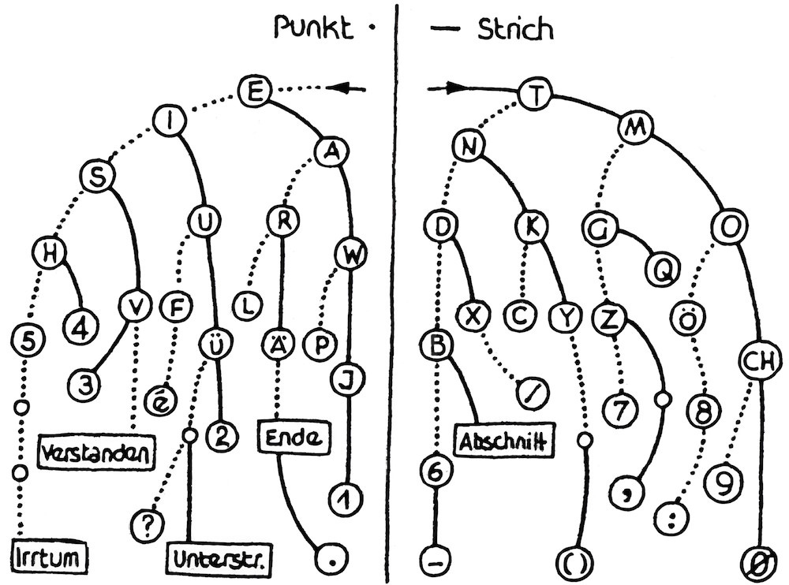
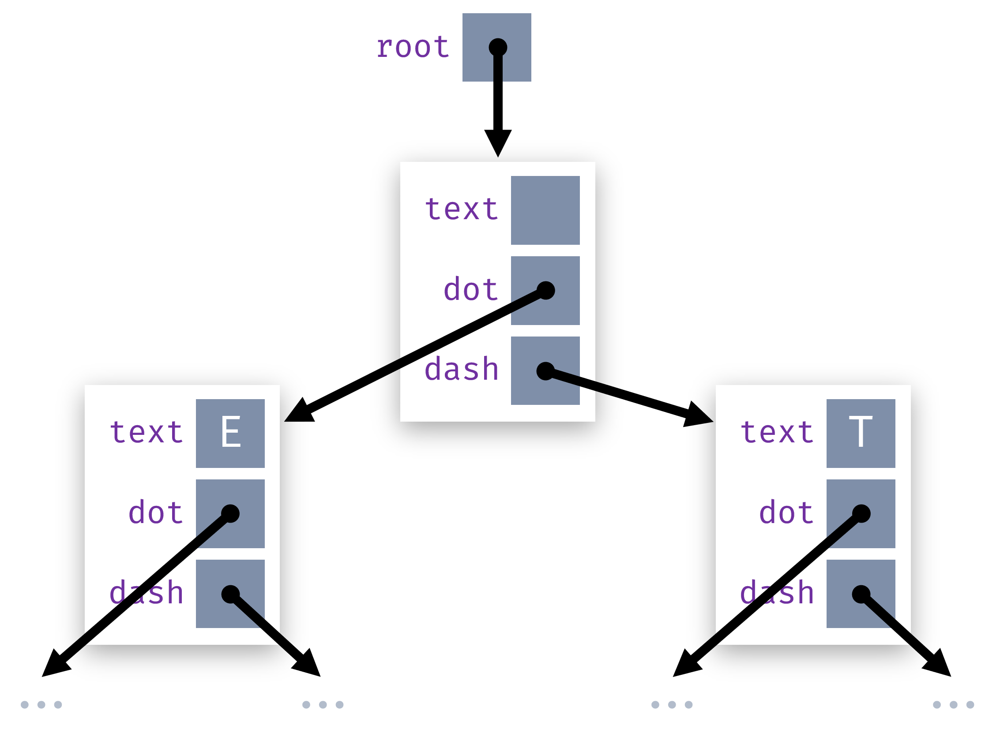

== Morsecode
:sectnums:
:page-pdf-download: true
:icons: font
:table-grid: none
:table-frame: ends
:table-stripes: even

Implementiere die Klasse `MorseDecoder`, welche einen https://de.wikipedia.org/wiki/Morsecode[Morsecode] in Text umwandelt. Dazu soll die Klasse einen https://de.wikipedia.org/wiki/Bin%C3%A4rbaum[_Binärbaum_] aufbauen, welcher folgendem Morseschlüssel entspricht:

[.text-center]

Die Klasse soll man folgendermassen verwenden können:

[source,java]
----
var decoder = new MorseDecoder();
var code = ".-- .. -. -.. .. ... ----";
var text = decoder.decode(code);
System.out.println(text);
----

Dieses Programm sollte `WINDISCH` ausgeben.

Der `MorseDecoder` muss dazu als Erstes eine Struktur von Objekten und Referenzen aufbauen, die den Morseschlüssel repräsentiert. Dazu erstellst Du eine zusätzliche kleine Klasse, die einem einzelnen _Knoten_ im Baum entspricht und drei Attribute hat:

* Den Buchstaben bei diesem Knoten (bzw. zwei, für den Fall `----`)
* Den nächsten Knoten, wenn es mit _Punkt_ weitergeht (oder sonst `null`)
* Den nächsten Knoten, wenn es mit _Strich_ weitergeht (oder sonst `null`)

Alle Knoten zusammengefügt ergeben den Baum:

[.text-center]

Die Methode `decode` kann dann den Morsecode Schritt für Schritt durchgehen und den Referenzen im Baum folgen, beginnend beim _Wurzelknoten_ (`root`). Das geht so lange, bis ein Leerzeichen im Code erreicht wird, was bedeutet, dass ein Buchstabe abgeschlossen ist. Dann wird der Buchstabe beim aktuellen Knoten ausgelesen und (falls der Code noch nicht zu Ende ist) für den nächsten Buchstaben wieder beim `root` begonnen.

Für diese Aufgabe ist eine vollständige Test-Suite vorgegeben, welche definiert, welche Zeichen der `MorseDecoder` unterstützen soll. Du kannst Deine Implementierung auch mit dem Programm `MorseDecoderApp` ausprobieren.