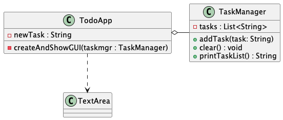
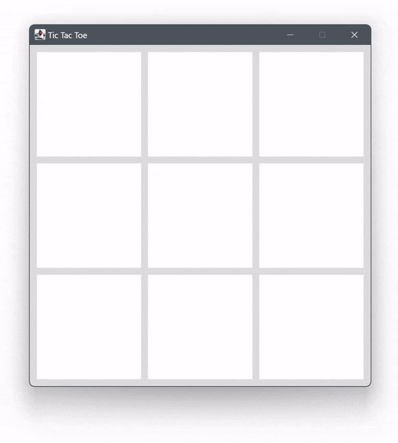

= Clean Code und Refactoring
:sectnums:
:sectnumlevels: 2
:experimental:
:icons: font

== Refactoring

Gut lesbarer Code hilft, Fehler zu verhindern oder schneller zu erkennen.
Das ist ein Grund, Refactorings zu machen.
Ein weiterer Grund sind Überlegungen zum Software-Design.
Damit meinen wir nicht das UI, sondern die Art und Weise wie der Code organisiert ist.
Das Ziel von gut organisiertem Code ist eine gute Wartbarkeit.
Es hat sich gezeigt, dass eine gute Wartbarkeit erreicht wird, wenn nach folgenden Designprinzipien gearbeitet wird:

* Modularität: wenn der Code in gute Teile gegliedert ist.
* Separation of Concerns: wenn die Gliederung so gestaltet ist, dass bei Änderungen möglichst nur ein Modul angefasst werden muss, weil nur dieser Teil für etwas verantwortlich ist.
* Kohäsion: Dinge, die zusammengehören, sollen möglichst nah beieinander sein.
Wir haben das schon gehört, indem wir z. B. die Deklaration einer Variable nahe bei der ersten Verwendung halten.
Module sollen ebenfalls möglichst viel beinhalten, was sie für ihre Aufgabe brauchen.
* Loose Kopplung: Kopplung bezeichnet das Mass, wie eng zwei oder mehrere Module voneinander abhängig sind.
Das Ziel ist eine loose Kopplung, was Änderungen leichter möglich macht.
* Abstraktion: Abstraktionen erscheinen einem zuerst komplizierter, weil sie ein gewisses Wissen voraussetzen.
Wenn man aber gängige Abstraktionsmuster (z. B. Designpatterns) kennt, ist man oft in der Lage, elegantere und besser wart- und erweiterbare Software zu schreiben.
Abstraktionen sind auch die Voraussetzung, um eine lose Kopplung zu erreichen.

Diese Prinzipien im Detail zu beurteilen, erfordert einiges an Erfahrung und sprengt den Rahmen dieses Moduls.

Ganz allgemein können wir aber sagen, dass wenn eine gute Testbarkeit gegeben ist, die Designprinzipien in den meisten Fällen eingehalten werden.

Und da wir zuerst die Tests schreiben :-), ist eine gute Testbarkeit automatisch gegeben und die Chance, dass wir gut organisierten Code schreiben, steigt ebenfalls.

Selbst mit einem testgetriebenen Ansatz ist es nicht immer einfach, sofort schönen Code zu schreiben.
Es macht durchaus Sinn, erst mal die Funktionalität zu erreichen, das wissen wir, weil die entsprechenden Tests grün sind und sich dann zu überlegen, ob der Code auch für andere verständlich und lesbar ist.

Ein weiterer Anwendungsfall für Refactoring ist dann gegeben, wenn wir neue Funktionalität in vorhandenen Code einbauen wollen.
Bei grösseren Änderungen kann es Sinn machen, zuerst das Design anzupassen, *bevor* man die neue Funktionalität einfügt oder einfügen kann.

Wichtig ist, dass wir erkennen, dass wir mit dem Programmieren nicht fertig sind, wenn das Feature mal gerade so läuft, sondern dass wir dann noch den Code so schreiben (Stichwort Aufräumen), dass andere und auch wir selber den Code später wieder verstehen.

=== Was bedeutet Refactoring?

Der Begriff Refactoring bezeichnet alle Aktivitäten, bei denen zwar der Code verändert wird, sich aber das Verhalten der Applikation nicht ändert.
D. h. Refactoring hat *keine* Auswirkungen auf die Funktionalität, es ändert sich nichts.
Falls man einen Fehler verbessern will und vorher refactored, kann es natürlich sein, dass ein Test rot bleibt).

Refactoring kann, muss aber nicht Auswirkungen auf nicht-funktionale Anforderungen wie Performanz, Antwortzeit etc. haben.

Im test-getriebenen Vorgehen wird deutlich unterschieden zwischen dem Implementieren eines Features und dem Refactoring:

* red: Schreiben und Ausführen des Tests - der neue Test ist rot.
* green: Implementierung des Features - alle Tests sind grün.
* **Refactoring**: Überarbeiten der Implementierung: alle Tests bleiben grün.
* **Commit**: Dieser Zustand ist gut genug und wird committed.

=== Automatische Refactorings

Viele IDEs bieten eine Vielzahl von automatischen Refactorings an.
Im Gegensatz zur Verwendung von AI Unterstützung, sind diese Refactorings deterministisch implementiert, d. h. bei gleichem Input kommt immer wieder das gleiche Resultat heraus.

Das ist bei KI-Agenten oder Chatbots nicht zwingend gegeben.

Das macht es immer noch wichtig und attraktiv diese Refactoring-Tools zu kennen.
Ausserdem werden durch die Verwendung von lokalen Tools weniger Ressourcen verwendet als bei Anfragen an eine KI.

Die meisten IDEs unterstützen automatische Refactorings, wir schauen uns ein paar Refactorings von IntelliJ IDEA an, welche sehr viele Refactorings unterstützt.

=== Refactorings in IntelliJ IDEA

Refactorings sind unter einem eigenen Menüpunkt zusammengefasst.
Die Einträge sind allerdings abhängig von der Cursor-Position in einer Datei.

Nachfolgend sind vier automatische Refactorings aufgeführt, die man sehr häufig braucht und die man auch in der in diesem Block gestellten Aufgabe anwenden kann.

Bei den Refactorings steht jeweils ein (zugegeben etwas konstruiertes) Beispiel, bei dem die beschriebenen Refactorings ausgeführt werden können und auch sollen.

NOTE: Wir werden die Beispiele in der Klasse gemeinsam refactorn. Überlege Dir schon mal, wie das Ergebnis nach dem Refactoring aussehen sollte und warum! Du kannst mit Aufklappen des Ziels überprüfen, ob wir dieselben Vorstellungen haben.

==== Rename …

Rename kann für Variablen, Methoden und Klassen verwendet werden.
Es ist sehr praktisch, da es uns erspart, alle aufrufenden Stellen einer Variable, Methode oder Klasse von Hand anzupassen.
Der Shortcut ist: kbd:[Shift+F6].

==== Extract/Introduce …

Wenn wir Code überarbeiten, dann wollen wir oft gewisse Codeteile in eine andere Struktur überführen.
Das betrifft v. a. *Variablen, Konstanten, Parameter oder Methoden*.

Je nach Kontext heissen diese Refactorings «extract …» oder «introduce …».
Auch hier ersparen uns automatische Refactorings das manuelle Anpassen des Codes, in dem automatisch alle zu ändernden Stellen erkennt werden.

So können wir aus dem folgenden Beispiel nur mit automatischen Refactorings den Code in eine «richtige» Klassenstruktur bringen:

[source, java, linenum]
----
public class Circle {
    public void printInfo() {
        System.out.println(2 * Math.PI * 10);
        System.out.println(Math.PI * 10 * 10);
    }

}
----

.Ziel
[%collapsible]
====
[source, java, linenum]
----
public class Circle {

    private final int radius;

    public Circle() {
        radius = 10;
    }

    public void printInfo() {
        System.out.println(diameter());
        System.out.println(area());
    }

    public double area() {
        return Math.PI * radius * radius;
    }

    public double diameter() {
        return 2 * Math.PI * radius;
    }
}

----
====

==== Inline …

Damit können wir überflüssige *Variablen* oder *Methodenaufrufe* elegant eliminieren.
IDEA gibt uns dabei die Wahl, ob wir das für alle Aufrufe möchten (und dabei die Methode gleich löschen) oder nur in einem Fall.

*Beispiel:*
[source, java, linenum]
----
public class Messenger {
    private String message;

    public Messenger(String message) {
        this.message = message;
    }

    public void printMessage() {
        String message = getMessage();
        print(message);
    }

    private void print(String message){
        System.out.println(message);
    }

    public String getMessage() {
        if (message.isEmpty()){
            return "no message";
        }
        return message;
    }
}
----

.Ziel
[%collapsible]
====
[source, java, linenum]
----
public class Messenger {
private String message;

    public Messenger(String message) {
        this.message = message;
    }

    public void printMessage() {
        System.out.println(getMessage());
    }

    public String getMessage() {
        if (message.isEmpty()){
            return "no message";
        }
        return message;
    }
}
----
====

==== Move …

ist ein weiteres automatisches Refactoring, dass automatisch Codeteile verschiebt.
Damit können Methoden in eine andere Klasse oder Klassen (oder Dateien) in ein anderes Package verschoben werden und wiederum werden alle Codestellen, welche das verschobene Objekt verwenden, automatisch angepasst.
Nicht immer geht das Verschieben von Methoden in einem einzigen Schritt, wie wir an diesem Beispiel sehen.

*Beispiel:*
[source, java, linenum]
----

public class Order {
    private Product product;
    private int quantity;

    public Order(Product product, int quantity) {
        this.product = product;
        this.quantity = quantity;
    }

    public double getTotalPrice() {
        return product.calculatePriceForQuantity(quantity);
    }

    public int getQuantity() {
        return quantity;
    }
}

public class Product {
    private String name;
    private double price;

    public Product(String name, double price) {
        this.name = name;
        this.price = price;
    }

    public double getPrice() {
        return price;
    }

    public double calculatePriceForQuantity(int quantity) {
        return price * quantity;
    }
}
----

.Ziel
[%collapsible]
====
[source, java, linenum]
----
public class Order {
    private Product product;
    private int quantity;

    public Order(Product product, int quantity) {
        this.product = product;
        this.quantity = quantity;
    }

    public double getTotalPrice() {
        return product.getPrice() * quantity;
    }

    public int getQuantity() {
        return quantity;
    }
}

public class Product {
    private String name;
    private double price;

    public Product(String name, double price) {
        this.name = name;
        this.price = price;
    }

    public double getPrice() {
        return price;
    }

}
----

====

=== Manuelle Refactorings

Manuelle Refactorings sind alle anderen Änderungen am Code, welche keine Auswirkungen auf das Verhalten des Codes haben.
Natürlich können wir auch alle automatischen Refactorings von Hand durchführen, bei grossen Codebasen geht das länger und ist z. T. auch fehleranfälliger.

[NOTE]
--
Wenn man ausserhalb des red/green/refactor Zyklus Code ändert, ist es eine gute Idee, Refactorings separat von neuem Verhalten zu committen.
Das kann durch folgende Konvention in den Commit-Messages ausgedrückt werden:

* «R: <Commit Message>» -> nur automatische Refactorings im Commit
* «r: <Commit-Message>» -> automatische und manuelles Refactorings.

Diese Konvention macht es einfacher den Code zu reviewen, wenn ausschliesslich automatische Refactorings der IDE verwendet werden, kann davon ausgegangen werden, dass die Änderungen ok sind.
--

IMPORTANT: Nach jedem Refactoring (manuell oder automatisch) lassen wir alle Tests laufen, um sicherzustellen, dass wir nichts Funktionales verändert haben.

[#to-do-liste]
== Aufgabe: To-Do-Liste

Als erste Aufgabe gilt es eine kleine To-Do-Liste-Applikation zu verbessern.
Aktuell ist alles in einer Klasse implementiert. Da später zusätzliche Anforderungen implementiert werden sollen, haben wir entschieden, zum jetzigen Zeitpunkt eine vernünftige Aufteilung anzustreben, um ein gutes Design möglichst iterativ zu erhalten. Im PDF sind die schrittweisen Refactorings aufgeführt um das Ziel zu erreichen.

Ziel:

xref:res/Workshop_ToDoApp.pdf[Anleitung zum Refactoring]

== Aufgabe: Tic Tac Toe

In der nachfolgenden Aufgabe geht es um das Spiel https://de.wikipedia.org/wiki/Tic-Tac-Toe[Tic-Tac-Toe].

Ihr müsst das Spiel nicht selber implementieren, sondern ihr findet in der Klasse `TicTacToeApp` findet ihr ein vollständiges Programm inklusive einem einfachen GUI

[.text-center]

Das Programm funktioniert zwar korrekt, aber unter dem Gesichtspunkt der Designprinzipien gibt es einige Probleme:

1. Das Programm ist nicht https://de.wikipedia.org/wiki/Modulare_Programmierung[_modular_]: Die gesamte Funktionalität ist in der Klasse `TicTacToeApp` implementiert, was die Wartbarkeit und Erweiterbarkeit erschwert.
2. Die GUI-Aspekte und die Spiellogik sind nicht https://en.wikipedia.org/wiki/Separation_of_concerns[_getrennt_]: Die Klasse `TicTacToeApp` kümmert sich sowohl um die GUI als auch um die Spiellogik, was es schwieriger macht, die einzelnen Aspekte des Programms zu verstehen.
3. Als Folge davon ist die Spiellogik auch nicht https://de.wikipedia.org/wiki/Softwaretest[_testbar_]: Da die Logik mit dem GUI-Code vermischt ist, kann sie nicht (oder zumindest nicht so leicht) getestet werden.
Entsprechend sind auch keine Unit-Tests vorhanden.

Eure Aufgabe ist es, das Programm umzustrukturieren, sodass diese Probleme behoben werden und damit eine bessere Wartbarkeit sichergestellt ist.

Die Spiellogik soll sich nach der Umstrukturierung in einer separaten Klasse `TicTacToe` befinden, die GUI in der Klasse `TicTacToeGui`.
Zudem sollt ihr die Spiellogik ausführlich testen, indem ihr Unit-Tests für die Klasse `TicTacToe` schreibt.

Etwas Designarbeit wurde bereits gemacht, so soll die Klasse `TicTacToe` folgende Schnittstelle bieten:

`TicTacToe()`:: Konstruktor, der ein neues Spiel initialisiert.
Nachdem ein Spiel fertig gespielt ist, ist das Objekt «aufgebraucht» und es muss ein neues erstellt werden.

`Player getCurrentPlayer()`:: Gibt den Spieler zurück, der gerade an der Reihe ist.
Der Rückgabetyp ist nicht ein `int` oder `String`, sondern ein eigener `enum`-Typ `Player` mit zwei Werten: `Player.X` und `Player.O`.
Das macht den Code lesbarer und verhindert Fehler.
+
Falls das Spiel bereits beendet ist (siehe unten), wird eine `IllegalStateException` geworfen.

`void play(int row, int col)`:: Verantwortlich für einen Spielzug: Die Methode setzt ein Kreuz oder einen Kreis (je nachdem, wer gerade dran ist) in das Feld in der angegebenen Zeile und Spalte. Falls an der Stelle bereits ein Kreuz oder ein Kreis steht, wird dieser Zug ignoriert.
Sie beendet den Spielzug, indem sie sicherstellt, dass danach der andere Spieler an der Reihe ist.
+
Beachtet dabei folgende *Vorbedingungen* (Bedingungen, die erfüllt sein müssen, damit ein Spielzug überhaupt ausgeführt werden kann):

* Falls `row` oder `col` ausserhalb des Spielfelds liegen, soll eine `IllegalArgumentException` geworfen werden.
* Falls das Spiel bereits beendet ist,  (siehe unten), wird eine `IllegalStateException` geworfen.

`Player getField(int row, int col)`:: Gibt den Spieler zurück, der in das Feld in der angegebenen Zeile und Spalte gesetzt hat.
Falls das Feld leer ist, wird `null` zurückgegeben.

`Player getWinner()`:: Gibt den Gewinner des Spiels zurück, falls es bereits einen gibt.
Falls das Spiel unentschieden ausgeht oder noch gar nicht fertig ist, wird `null` zurückgegeben.

`boolean isOver()`:: Gibt `true` zurück, falls das Spiel fertig ist, d. h. entweder ein Spieler gewonnen hat oder das Spielfeld voll ist.
Ansonsten `false`.

Versucht beim Testen die gesamte Funktionalität der Klasse `TicTacToe` abzudecken.
Dazu gehören auch die Vorbedingungen der Methoden, die ihr mit `assertThrows` testen könnt:

[source,java]
----
assertThrows(IllegalArgumentException.class, () -> {
    game.play(-1, 0);
});
----

Berücksichtigt insbesondere die 8 möglichen Arten, wie ein Spiel enden kann (3 Zeilen, 3 Spalten und 2 Diagonalen).
